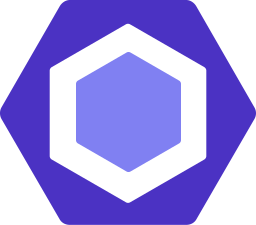

# Getting started

Welcome to `workleap/web-configs`, a collection of **configuration libraries** for building web applications at [Workleap](https://workleap.com/). On this getting started page, you'll find an overview of the project and a list of supported tools.

!!!warning Before you continue...

The prefered way for using these configuration libraries is **not** by installing them manually, but rather by **scaffolding** your application with Workleap's [foundry-cli](https://github.com/gsoft-inc/wl-foundry-cli).

+++ pnpm
```bash
pnpm create @workleap/project@latest <output-directory>
```
+++ yarn
```bash
yarn create @workleap/project@latest <output-directory>
```
+++ npm
```bash
npm create @workleap/project@latest <output-directory>
```
+++
!!!

## Why?

Starting a new web application is still an arduous task. There are so many tools to choose from, learn, install and configure, it can be daunting.

For an organization like [Workleap](https://workleap.com/), with a large suite of products, it **doesn't make sense to start over every time** we invest in a new idea or add a new vertical to an existing product. Developers working on a new project shouldn't spend their first day's figuring out which [ESLint](https://eslint.org/) rules to enable/disable, or how to transpile their [React](https://react.dev/) code, they should rather **focus on writing features code**.

### Filling the gap

While a collection of common configurations gets us closer to that goal, on their own, configuration libraries are not enough to reach it. There is still a need to install and assemble those configurations correctly in the new application, which can also be a challenge. To fill this gap, we choosed to invest as well in a [CLI](https://github.com/gsoft-inc/wl-foundry-cli) to scaffold new web applications and libraries.

### Best of both worlds

With the CLI, developers can generate fully configured web applications in a few minutes. However, contrary to configuration libraries, a CLI alone is only good at creating the initial files of an application, it doesn't help with the **maintenance** or the **adoption of new features** offered by tools over time.

That's why we need both, there's a strong synergy between a collection of configuration libraries and a CLI.

With configuration libraries **distributed through NPM packages** and installed with a CLI, when a new feature is available for a tool, the configuration libraries maintainers can spend time learning the new feature, making the necessary changes, and **distributing the changes with a new version** of the package. Then, at their convenience, **product teams can adopt the changes** by bumping the configuration library package version in their respective application.

We hope that introducing CLI with a collection of configuration libraries will facilitate the creation and maintenance of front-end projects.

## Guiding principles

While developing the configuration libraries, we kept one guiding principle in mind, **no locked in** :heart::v:. We truly hope that the default configurations will satisfy your application needs, but if it doesn't, there will always be an easy way to extend or override the default configuration.

## Supported tools

| Name | NPM | Documentation |
| --- | --- | --- |
| { class="h-5 w-5 mr-2 -mt-1" }[Browserslist](https://browsersl.ist/){ target="_blank" } | [](https://www.npmjs.com/package/@workleap/browserslist-config){ target="_blank" } | [Getting started](browserslist/default.md) |
| { class="h-5 w-5 mr-2 -mt-1" }[ESLint](https://eslint.org/){ target="_blank" } | [](https://www.npmjs.com/package/@workleap/eslint-plugin){ target="_blank" } | [Getting started](eslint/default.md) |
| { class="h-5 w-5 mr-2 -mt-1" }[PostCSS](https://postcss.org/){ target="_blank" } | [](https://www.npmjs.com/package/@workleap/postcss-configs){ target="_blank" } | [Getting started](postcss/default.md) |
| { class="h-5 w-5 mr-2 -mt-1" }[Stylelint](https://stylelint.io/){ target="_blank" } | [](https://www.npmjs.com/package/@workleap/stylelint-configs){ target="_blank" } | [Getting started](stylelint/default.md) |
| { class="h-5 w-5 mr-2 -mt-1" }[SWC](https://swc.rs/){ target="_blank" } | [](https://www.npmjs.com/package/@workleap/swc-configs){ target="_blank" } | [Getting started](swc/default.md) |
| { class="h-5 w-5 mr-2 -mt-1" }[tsup](https://tsup.egoist.dev/){ target="_blank" } | [](https://www.npmjs.com/package/@workleap/tsup-configs){ target="_blank" } | [Getting started](tsup/default.md) |
| { class="h-5 w-5 mr-2 -mt-1" }[Typescript](https://www.typescriptlang.org/){ target="_blank" } | [](https://www.npmjs.com/package/@workleap/typescript-configs){ target="_blank" } | [Getting started](typescript/default.md) |
| { class="h-5 w-5 mr-2 -mt-1" }[webpack](https://webpack.js.org/){ target="_blank" } | [](https://www.npmjs.com/package/@workleap/webpack-configs){ target="_blank" } | [Getting started](webpack/default.md) |


